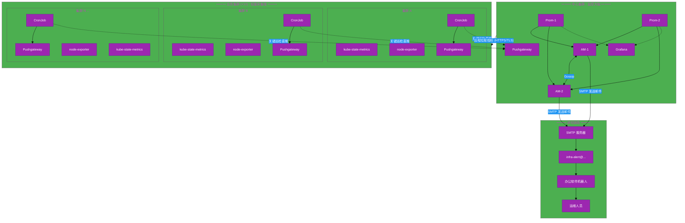
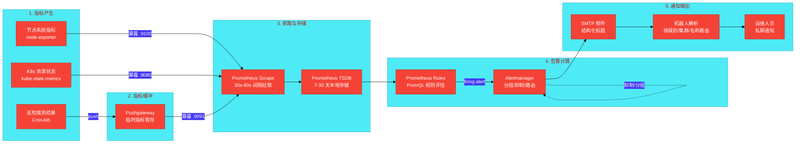

# #1 多集群基础设施主动监控体系 架构设计说明书 (Architecture Design Document)

---

## 1. 基础信息

* **需求链接**: **[TODO]**
* **需求名称**: 开源社区多集群基础设施主动监控体系设计
* **开发责任人**: **[TODO]**_githubid & gitcodeid_
* **设计目标**: 构建跨 10 个 Kubernetes 集群的统一可观测性平台，通过中心化 Prometheus HA + Alertmanager 集群实现指标采集、告警计算与结构化邮件通知，主动发现组件、网络、存储、云资源故障，交由办公软件机器人解析并分发给对应责任人。

---

## 2. 功能设计

> **说明**：描述系统的组件构成、职责划分及交互逻辑。

### 2.1 架构图

> 此处建议插入架构拓扑系统组件图或时序图，描述组件间的交互关系。推荐使用Mermaid实现，可代码化，GitHub可渲染。
> **不涉及需要说明原因**

**设计说明/归档:** 本架构图展示了集中式监控体系的逻辑拓扑：中心集群（监控大脑）与业务集群（轻量采集端）的组件关系、数据流向及通知链路。

**系统架构拓扑图：**



**说明：**
- 三层垂直结构：中心集群（监控大脑）→ 业务集群（采集端）→ 通知链路，数据自下而上汇聚
- 业务集群内：CronJob 巡检脚本 push 到本集群 Pushgateway；关键巡检项通过虚线直推中心 Pushgateway 冗余
- 中心 Prometheus HA 对通过 TLS 远程拉取各集群 exporter 端点（kube-state-metrics :8080, node-exporter :9100, Pushgateway :9091）
- Alertmanager Gossip 集群去重后统一通过 SMTP 发送结构化标题邮件到唯一邮箱，办公软件机器人轮询解析后私聊通知

### 2.2 数据流图

> 此处建议插入数据流图，描述核心业务数据的生命周期，即威胁建模的基础。推荐使用Mermaid实现，可代码化，GitHub可渲染。
> **不涉及需要说明原因**

**设计说明/归档:** 本数据流图展示了从指标产生到告警通知的完整数据生命周期，覆盖采集、传输、存储、计算、通知五个阶段。

**指标数据流与告警生命周期：**



**说明：**
- 指标采集分两类：长驻指标（node-exporter / kube-state-metrics）由 Prometheus 主动拉取；短生命周期任务（CronJob 巡检）先 push 到 Pushgateway 再被拉取
- 告警计算全部在中心 Prometheus 完成，通过 `cluster` 标签区分来源集群
- Alertmanager 负责抑制（inhibit）、分组（group_by）、路由和重复控制
- 邮件标题为固定结构化格式 `[级别][集群]-告警名称[-附加标签]`，机器人解析后私聊通知

### 2.3 组件职责与接口

> 列出新增/修改的组件及其定义的 API 规范。**不涉及需要说明原因**

**设计说明/归档:** 本体系涉及的组件分中心集群和业务集群两类，均为开源标准组件，接口协议基于 Prometheus exposition format 和 SMTP。

**中心集群组件：**

| 组件名称 | 职责 | 输入 | 输出 | 接口/端口 |
|---------|------|------|------|----------|
| **Prometheus (HA×2)** | 指标抓取、TSDB 存储、告警规则计算 | 各集群 exporter metrics | 告警推送至 Alertmanager | `:9090` (API), scrape 目标端口 |
| **Alertmanager (Gossip×2)** | 告警分组、抑制、去重、SMTP 路由 | Prometheus alert 推送 | SMTP 邮件 | `:9093` (API), `:9094` (Gossip mesh) |
| **Grafana** | 仪表盘可视化、多集群统一查询 | Prometheus datasource | 看板渲染 | `:3000` |
| **Pushgateway** | 接收 CronJob 临时指标、供 Prometheus 抓取 | CronJob HTTP PUT | Prometheus metrics | `:9091` |

**业务集群组件（每集群一套）：**

| 组件名称 | 职责 | 输入 | 输出 | 接口/端口 |
|---------|------|------|------|----------|
| **kube-state-metrics** | 暴露 K8s 资源对象状态（Pod/Deploy/SA 等） | K8s API | Prometheus metrics | `:8080` |
| **node-exporter** | 暴露节点系统指标（CPU/内存/磁盘/网络） | /proc, /sys | Prometheus metrics | `:9100` |
| **Pushgateway** | 接收本集群 CronJob 推送的巡检指标 | CronJob HTTP PUT | Prometheus metrics | `:9091` |
| **CronJob 巡检集 (×6)** | 周期性执行拨测脚本，结果 push 至 Pushgateway | 外部服务（GitHub/云API/共享盘） | Pushgateway PUT | 脚本 stdout → Pushgateway |

**关键接口规范：**

1. **Prometheus 抓取配置（file_sd_configs）：**
```yaml
- targets: ["cluster-a.internal:8080"]
  labels:
    cluster: prod-sh-1
    job: kube-state-metrics
```

2. **Alertmanager 邮件模板标题：**
```go
[{{ .Labels.severity }}][{{ .Labels.cluster }}] {{ .Labels.alertname }}{{ if .Labels.instance }}-instance-{{ .Labels.instance }}{{ end }}
```

3. **CronJob 向 Pushgateway 推送格式：**
```bash
cat <<EOF | curl --data-binary @- http://pushgateway:9091/metrics/job/cronjob_probe/cluster/${CLUSTER}
github_probe_success{cluster="${CLUSTER}"} 1
EOF
```

### 2.4 UX设计

> 设计目标：确保功能不仅"可用"，而且"好用"，降低开发者的认知负担和运维人员的误操作风险。 **不涉及需要说明原因**

**设计说明/归档:** 不涉及，本系统为基础设施监控平台，无面向终端用户的 UI 交互。运维人员通过 Grafana 看板（社区标准仪表盘）和邮件通知交互，无需额外 UX 设计。

### 2.5 SOD设计

> 设计目标：通过维护SOD权限设计文档，确保权限设计可审计、可复用、可跨服务重用。 SOD权限设计参考[XX SOD权限设计.md](XX%20SOD%E6%9D%83%E9%99%90%E8%AE%BE%E8%AE%A1.md)
>
>**不涉及需要说明原因**
>
>**需要说明文档位置**

**设计说明/归档:** 本系统的职责分离由 Kubernetes RBAC + Alertmanager 路由规则实现：
- 中心集群 `monitoring` 命名空间：监控管理员拥有 admin 权限
- 业务集群 `monitoring` 命名空间：仅部署采集器，无需访问中心集群
- 告警路由由办公软件机器人侧管理（不同集群通知不同运维组），监控系统自身不感知人员分工

### 2.6 功能设计分解TASK清单

**设计说明/归档:** 基于架构设计，将功能拆解为 8 个 Phase，对应实施计划中的各阶段任务。

**任务清单:**

| 任务 ID | 功能任务描述 | 责任人 |
|---------|-------------|--------|
| **TASK_PH1** | 中心集群搭建：部署 Prometheus HA 对 + Alertmanager Gossip 集群 + Grafana + Pushgateway | [TODO] |
| **TASK_PH2** | 首个业务集群接入：部署 kube-state-metrics、node-exporter、Pushgateway，打通抓取链路 | [TODO] |
| **TASK_PH3** | 巡检脚本开发：编写 6 个 CronJob 拨测脚本（GitHub/SA审计/云账号/共享盘/证书/镜像同步） | [TODO] |
| **TASK_PH4** | 告警规则编写：9 条 PromQL 规则 + Alertmanager 路由配置 + 邮件模板 | [TODO] |
| **TASK_PH5** | 邮件通知链路：配置 SMTP、端到端测试告警邮件送达 | [TODO] |
| **TASK_PH6** | 对接办公软件机器人：交付标题格式规范、联调解析与分发 | [TODO] |
| **TASK_PH7** | 批量接入剩余 9 个业务集群：模板化 YAML + 自动化接入脚本 | [TODO] |
| **TASK_PH8** | 运维配套：Silence 手册、Pushgateway 陈旧指标清理、值班响应手册 | [TODO] |

---

## 3. 非功能设计

### 3.1 安全与隐私设计评估和设计

> **注意**：仅当需求判定为 **`need_security`** 时，本章节为必填项。 **无该标签可删除本章节。**

> 关注点：防御能力与合规边界。

### 3.1.1 威胁分析 (Threat Modeling)

> 基于 **STRIDE** 或类似模型，识别本项目可能面临的安全威胁。推荐使用Mermaid绘制DFD数据流图和信任边界，展示系统的安全边界和数据流向。
> **建议归档服务模块设计图，后续需要可增量复用（导入设计文件到工具中即可复用增量设计）。**

**设计说明/归档:** 本威胁分析基于 STRIDE 模型，针对跨集群监控体系的三层信任边界，识别指标采集、传输、存储、告警通知全链路的安全威胁。

**威胁建模 — 信任边界图：**

```mermaid
%%{init: {
  'theme': 'base',
  'themeVariables': {
    'primaryColor': '#e91e63',
    'primaryBorderColor': '#c2185b',
    'primaryTextColor': '#ffffff',
    'fontSize': '14px'
  }
}}%%
graph TB
    subgraph "信任边界1: 中心集群 (高信任)"
        Prom[("Prometheus HA<br/>TSDB 指标数据")]
        AM[("Alertmanager<br/>告警状态")]
        GF[("Grafana<br/>看板")]
        CenterSec[("中心 Secret<br/>SMTP 凭据")]
    end

    subgraph "信任边界2: 业务集群 (中信任)"
        KSM[("kube-state-metrics")]
        NE[("node-exporter")]
        PG[("Pushgateway")]
        CJ[("CronJob 巡检")]
        ClusterSec[("集群 Secret<br/>云 AK/SK")]
    end

    subgraph "信任边界3: 外部服务 (低信任)"
        GitHub["GitHub API"]
        CloudAPI["云厂商 BSS API"]
        SMTP["SMTP 服务器"]
        Mailbox["企业邮箱"]
        Bot["办公软件机器人"]
    end

    subgraph "攻击面"
        Attacker["攻击者"]
        Leak["指标数据窃听"]
        Spoof["伪造指标注入"]
        CredTheft["凭据窃取"]
    end

    Prom -->|跨信任边界: TLS 抓取| KSM
    Prom -->|跨信任边界: TLS 抓取| NE
    Prom -->|跨信任边界: TLS 抓取| PG
    CJ -->|跨信任边界: push| PG
    CJ -.->|跨信任边界: 直推| Prom
    CJ -->|云 API 调用| CloudAPI
    CJ -->|API 调用| GitHub
    AM -->|跨信任边界: SMTP 认证| SMTP
    SMTP --> Mailbox
    Mailbox -->|IMAP/POP3| Bot
    Prom -->|告警推送 (内部)| AM
    GF -.->|查询 (内部)| Prom

    Attacker -.-> Leak
    Attacker -.-> Spoof
    Attacker -.-> CredTheft
    Leak -.->|窃听跨信任边界链路| Prom
    Spoof -.->|伪造 Pushgateway 数据| PG
    CredTheft -.->|窃取云 AK/SK| ClusterSec
    CredTheft -.->|窃取 SMTP 凭据| CenterSec
```

**说明：**
- 三层信任边界：中心集群（完全受控）→ 业务集群（部分受控，多团队共享）→ 外部服务（不受控）
- 跨越信任边界的数据流是高风险点：Prometheus 跨集群抓取、CronJob 访问云 API、Alertmanager 发送邮件
- 攻击面聚焦在传输窃听、伪造注入、凭据窃取三类

**威胁分析表：**

| 威胁类别 | 攻击场景描述 (Scenario) | 风险等级 | 对应减缓措施 (Mitigation) |
|---------|------------------------|---------|--------------------------|
| **信息泄露** | 跨集群抓取链路未加密，攻击者窃听获取集群指标数据（含 Pod 名、节点 IP 等敏感信息） | 高 | 全链路启用 TLS 1.2+ / mTLS；NetworkPolicy 限制抓取来源 IP |
| **信息泄露** | SMTP 凭据明文存储在 ConfigMap 中，被未授权访问者读取 | 高 | SMTP 凭据存入 Kubernetes Secret；启用 etcd 静态加密 |
| **信息泄露** | Grafana 未配置认证，任何人可匿名访问所有集群的指标面板 | 高 | 关闭匿名访问；接入 OAuth2/OIDC；最小化默认角色为 Viewer |
| **信息泄露** | 云账号 AK/SK 存储在 CronJob 环境变量中，被 Pod 内其他进程读取 | 高 | AK/SK 存入 Secret 并通过 envFrom 引用；CronJob 容器以非 Root 运行 |
| **篡改/伪造** | 攻击者向 Pushgateway 推送伪造指标，触发虚假告警或掩盖真实故障 | 中 | Pushgateway 端点配置 HTTP Basic Auth；网络策略限制推送来源 |
| **篡改/伪造** | 攻击者篡改中心 Prometheus 规则文件，禁用关键告警或注入恶意规则 | 中 | 规则文件通过 GitOps (ArgoCD) 管理，变更需 MR 评审；Prometheus 配置开启只读模式 |
| **权限提升** | CronJob 使用的云 API AK/SK 权限过大（如 Admin），攻击者可利用其操作云资源 | 中 | 实施最小权限原则：云 AK/SK 仅授予 BSS ReadOnly / SFS ReadOnly |
| **拒绝服务** | 攻击者向 Pushgateway 大量推送高基数指标，导致 Prometheus 内存耗尽 (OOM) | 中 | Pushgateway 端点限流；Prometheus 配置 `metric_relabel_configs` 过滤高基数标签 |
| **拒绝服务** | Alertmanager SMTP 连接被限流或阻断，告警邮件全部丢失 | 中 | 配置 webhook 备用通知通道；监控 `alertmanager_notifications_failed_total` 指标 |
| **隐私泄露** | Prometheus 日志中记录了查询参数（可能含敏感 namespace/Pod 名），被非授权人员查看 | 低 | 日志访问限制在 `monitoring` 命名空间管理员 |
| **重放攻击** | 攻击者截获并重放 CronJob 向 Pushgateway 的推送请求 | 低 | Pushgateway 指标具有幂等性（PUT 覆盖同名指标），重放不影响数据正确性 |

**参考资料：**
- 详见《架构设计说明书编写经验》第8章：威胁建模中的信任边界设计
- 详见《架构设计说明书编写经验》第16-20章：Mermaid图表应用指南

### 3.1.2 安全设计实现 (Security Mechanisms)

**设计说明/归档:** 针对威胁分析识别的 11 个威胁场景，从凭证管理、身份认证、传输加密、运行时隔离、日志审计五个维度实施安全控制。

* **凭证管理**：
  - SMTP 密码、云 AK/SK 严禁硬编码，统一存储于 Kubernetes Secret
  - Secret 通过 `envFrom.secretRef` 注入 CronJob Pod，不写入容器镜像或 ConfigMap
  - 云 AK/SK 采用最小权限策略（BSS ReadOnly、SFS ReadOnly），定期轮转（建议 90 天）
  - 中心集群 Secret 与业务集群 Secret 隔离，业务集群管理员不可访问中心凭据

* **身份认证与授权**：
  - 跨集群抓取启用 HTTP Basic Auth 或 Bearer Token（各 exporter 端点配置 `--web.auth.config`）
  - Grafana 接入 OAuth2/OIDC（GitHub OAuth 或社区 LDAP），关闭匿名访问
  - Kubernetes RBAC：中心集群 `monitoring` 命名空间仅监控管理员可写；业务集群 `monitoring` 命名空间部署权限最小化
  - NetworkPolicy：中心 Prometheus 抓取来源 IP 白名单，业务集群仅允许中心集群出口 IP

* **数据安全**：
  - 跨集群抓取链路启用 TLS 1.2+（Prometheus `scheme: https`，`tls_config` 配置 CA 证书）
  - 跨信任边界的 mTLS 链路（Prometheus 与 exporter 双向证书验证）
  - 指标数据传输过程不包含 Secret、Token 等敏感凭据
  - PVC 存储依赖华为云 EVS 加密（云平台侧静态加密）

* **运行时隔离**：
  - CronJob 容器以非 Root 用户运行（`securityContext.runAsNonRoot: true`）
  - 容器文件系统设为只读（`readOnlyRootFilesystem: true`），防止二进制篡改
  - Prometheus / Alertmanager 容器限制网络出站（仅允许必要的目标端口）
  - Grafana 禁止 Server-side Render（SSRF 风险），禁用内嵌 iframe

* **日志审计**：
  - Alertmanager 告警通知日志包含 4W 信息：Who（Alertmanager 实例）、When（firing 时间）、Where（目标集群）、What（alertname + 当前值）
  - Prometheus 规则变更走 Git 提交记录，可追溯每次修改的 author / diff / timestamp
  - 禁止在日志中记录完整 SMTP 密码或云 AK/SK

### 3.1.3 安全任务分解 (Security Task Breakdown)

> 将安全设计转化为具体的开发任务，需在代码或后续开发流程的安全配置中落实。

**任务清单:**

| 任务 ID | 安全任务描述 (Security Tasks) | 责任人 |
|---------|------------------------------|--------|
| **SEC-TASK1** | 配置跨集群抓取 TLS/mTLS：为各 exporter 端点签发/配置 TLS 证书，Prometheus 侧配置 `tls_config` | [TODO] |
| **SEC-TASK2** | 配置 exporter 端点认证：启用 HTTP Basic Auth，凭据存入 Secret | [TODO] |
| **SEC-TASK3** | Grafana 接入 OIDC 认证，关闭匿名访问，配置默认 Viewer 角色 | [TODO] |
| **SEC-TASK4** | 创建 SMTP 凭据和云 AK/SK 的 Secret，配置 CronJob 通过 envFrom 引用 | [TODO] |
| **SEC-TASK5** | 配置 NetworkPolicy：白名单限制 Prometheus 抓取来源 IP 和 Pushgateway 推送来源 | [TODO] |
| **SEC-TASK6** | 配置容器安全上下文：非 Root 运行、只读文件系统 | [TODO] |
| **SEC-TASK7** | 部署 cert-manager，配置 exporter 端 TLS 证书自动签发和续期 | [TODO] |

### 3.2 可靠性与韧性设计评估和设计

> **注意**：根据项目定级决定，含Core、Critical服务变更需要完成

> **关注点**：极端情况下的生存与恢复能力。

**设计说明/归档:** 本系统属于 CI/CD 基础设施的核心监控组件，需满足高可用要求。以下从冗余设计、降级策略、数据恢复三个维度说明。

**冗余设计：**

- **Prometheus HA 对：** 两个独立实例抓取相同目标，各自保留完整 TSDB。单实例宕机不影响告警计算和通知。
- **Alertmanager Gossip 集群 (×2)：** 共享告警状态（silence / inhibition / 已发送通知），单实例宕机不丢告警、不重复发送。
- **Grafana 降级为单实例：** 看板不可用时不影响告警通路，通过 PVC 持久化仪表盘配置，重建后可恢复。
- **业务集群采集器单实例：** 采集器故障仅影响本集群（且关键 CronJob 直推中心 Pushgateway 冗余）。

**降级策略：**

- 跨集群网络中断 → Prometheus 停止抓取 → 指标断点 → `for: 2m` 窗口内不触发告警 → 网络恢复后数据补齐（Prometheus 不回溯历史空洞，但不影响后续告警）
- SMTP 服务器不可用 → Alertmanager 内部重试 + 指数退避 → 同时监控 `alertmanager_notifications_failed_total` 触发独立告警
- 中心 Pushgateway 宕机 → CronJob 仅推集群侧 Pushgateway → 巡检指标降级为单路径（仍有数据）

**数据恢复：**

- Prometheus TSDB 使用 PVC 持久化，Pod 重建后数据完整恢复
- PVC 备份依赖华为云 EVS 快照策略（由平台侧配置）
- Alertmanager 静默规则在重启后丢失（Gossip 集群可恢复活跃静默），建议静默操作通过 API 执行并记录审计

**任务清单:**

| 任务 ID | 可靠性与韧性任务描述 | 责任人 |
|---------|---------------------|--------|
| **REL-TASK1** | 配置 Prometheus StatefulSet 反亲和 (`podAntiAffinity`)，确保两个实例分散在不同节点 | [TODO] |
| **REL-TASK2** | 配置 Alertmanager Gossip 集群健康监控：`alertmanager_cluster_health_score` 告警 | [TODO] |
| **REL-TASK3** | 部署 Meta-monitoring 拨测器：独立探测 Prometheus / Alertmanager / SMTP 连通性，走非邮件通道通知 | [TODO] |
| **REL-TASK4** | 配置华为云 EVS 快照策略，定期备份 Prometheus PVC | [TODO] |

---

### 3.3 可服务性与可观测性评估和设计

> **关注点**：排障效率与全生命周期管理，确保故障可感知、可定位、可修复。

**设计说明/归档:** 本系统自身即是一个可观测性平台，以下从监控自检、排障手段、变更管理三个维度说明。

**监控自检 (Meta-monitoring)：**

- 中心集群外部部署独立拨测器，定时探测 Prometheus `/-/healthy`、Alertmanager `/-/healthy`、Pushgateway `/metrics`、SMTP 连通性
- 拨测告警走独立于邮件之外的通知通道（IM webhook），确保邮件系统故障时仍可感知
- 关键自检指标：
  - `prometheus_tsdb_head_series`（两个 HA 实例差异 > 20% → 告警）
  - `alertmanager_notifications_failed_total`（增量 > 0 → 告警）
  - `kube_job_status_failed{job_name=~".*probe.*"}`（CronJob 失败 → 告警）
  - `time() - cronjob_last_run_timestamp > 600`（CronJob 心跳超时 → 告警）

**排障手段：**

- 提供错误码对照表：

| 现象 | 可能原因 | 排查步骤 |
|------|---------|---------|
| Prometheus target DOWN | 跨集群网络不通 / 证书过期 / exporter 宕机 | `curl -v` 从中心集群测目标端点；`kubectl logs` exporter Pod |
| 告警未触发 | 规则语法错误 / `for` 未满足 / 指标消失 | `promtool check rules` 校验；Prometheus `/rules` 页面查规则状态 |
| 邮件未收到 | SMTP 限流 / 密码过期 / Alertmanager 路由错误 | `kubectl logs alertmanager-0`；`swaks` 测试 SMTP 连通性 |
| Pushgateway 指标陈旧 | CronJob 未执行 / 脚本报错 | `kubectl get jobs -n monitoring`；查看 CronJob 最近执行日志 |

**变更管理：**

- 所有 Prometheus 规则、Alertmanager 配置、CronJob 脚本通过 Git 管理，ArgoCD 自动同步
- 告警规则变更需 `promtool check rules` 通过后方可合并
- 新增集群接入使用标准化 Helm Chart / Kustomize overlay，避免手动逐集群操作

**任务清单:**

| 任务 ID | 可服务性任务描述 | 责任人 |
|---------|-----------------|--------|
| **OBS-TASK1** | 部署 Meta-monitoring 拨测 CronJob（独立集群），配置 IM webhook 告警通道 | [TODO] |
| **OBS-TASK2** | 编写排障手册：包含错误码对照表及对应的排查步骤 | [TODO] |
| **OBS-TASK3** | 配置 ArgoCD ApplicationSet，实现所有集群采集组件的 GitOps 自动同步 | [TODO] |
| **OBS-TASK4** | 编写 Silence 操作 SOP：维护前通过 Alertmanager API 创建静默的操作步骤 | [TODO] |

---

### 3.4 性能与伸缩性评估和设计

> **关注点**：社区生态兼容性与未来扩展。

**设计说明/归档:** 本系统需支持从 1-2 个集群验证期平滑扩展到 10+ 集群满配。以下从资源模型、扩展路径、基数控制三个维度说明。

**资源模型（10 集群 / 50 节点/集群 / 450K active series）：**

| | 中心集群 | 单业务集群 | 说明 |
|---|---------|-----------|------|
| CPU request | **8.5C** | **700m** | 中心 Prometheus HA 对占 8C，业务集群 node-exporter DaemonSet 占大头 |
| 内存 request | **33Gi** | **3.5Gi** | 中心 Prometheus HA 对占 32Gi |
| 磁盘 (30天) | **170Gi** | — | 仅中心 Prometheus PVC，业务集群无持久化 |

**水平扩展路径：**

- **Prometheus 单实例上限：** 约 500K-1M active series（受内存限制）。当前 450K series 在安全水位内。
- **触发 Thanos/VictoriaMetrics 引入条件：** 单实例内存 > 64Gi，或集群数 > 20，或需跨全局查询
- **业务集群采集器：** 每集群独立，互不影响。新增集群仅增加本集群的采集器资源，不影响中心 Prometheus 抓取性能（仅增加 scrape target 数量）
- **服务发现演进：** 初期使用 `file_sd_configs` 静态文件（Git 管理）→ 后期可迁移到 Consul 或 Kubernetes API SD 动态发现

**基数控制（关键性能保障）：**

- 在 scrape 阶段通过 `metric_relabel_configs` 丢弃高基数标签：
  ```yaml
  metric_relabel_configs:
    - action: labeldrop
      regex: "pod|container|container_id|uid"
    - action: labelkeep
      regex: "__name__|cluster|namespace|deployment|job"
  ```
- 抓取间隔从默认 15s 放宽至 60s（跨集群场景），减少 75% 的样本摄入量
- Pushgateway 定时清理陈旧指标，避免无效 series 堆积

**任务清单:**

| 任务 ID | 性能任务描述 | 责任人 |
|---------|-------------|--------|
| **PERF-TASK1** | 配置 Prometheus `metric_relabel_configs` 基数控制规则 | [TODO] |
| **PERF-TASK2** | 部署 Pushgateway 陈旧指标清理 CronJob（每 30m 清理一次） | [TODO] |
| **PERF-TASK3** | 编写 Prometheus 资源水位监控看板（内存/CPU/磁盘/active series），Grafana 告警阈值 | [TODO] |

---
